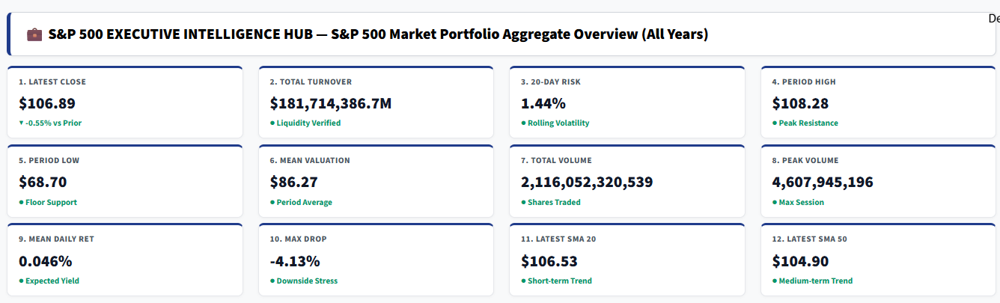
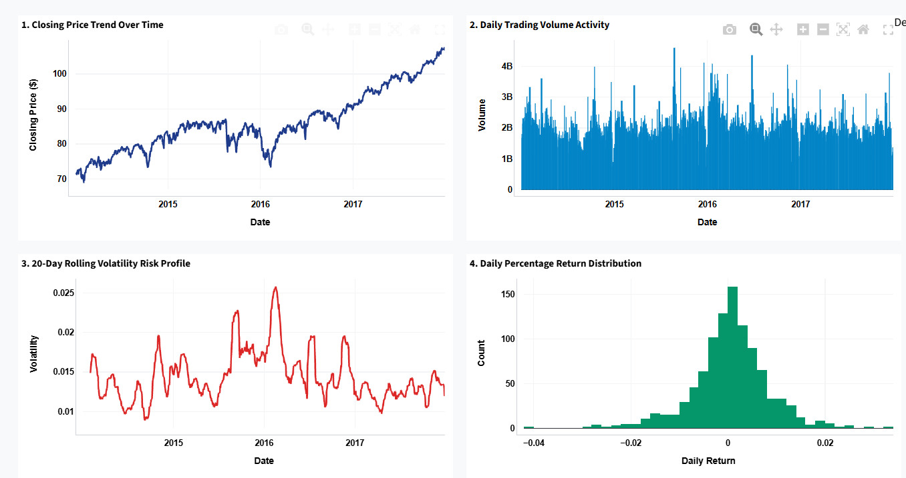
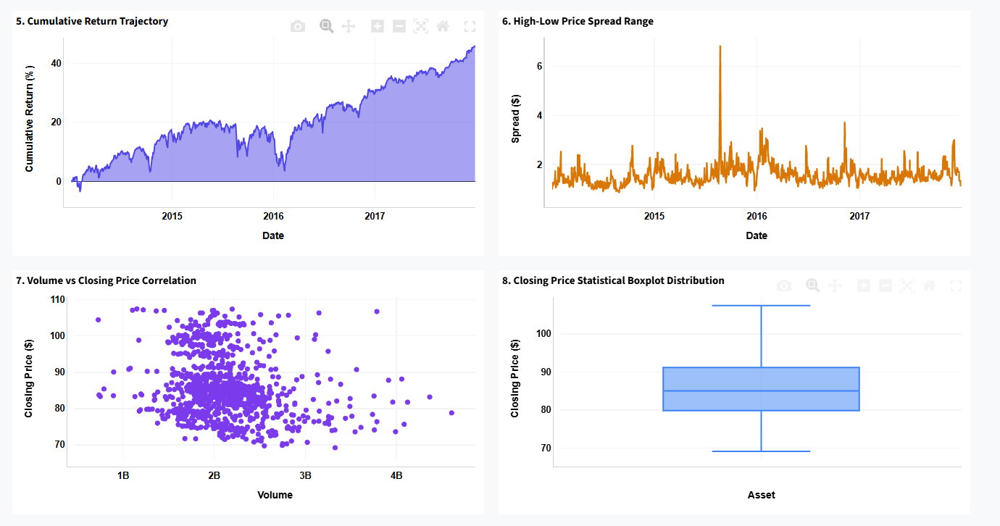
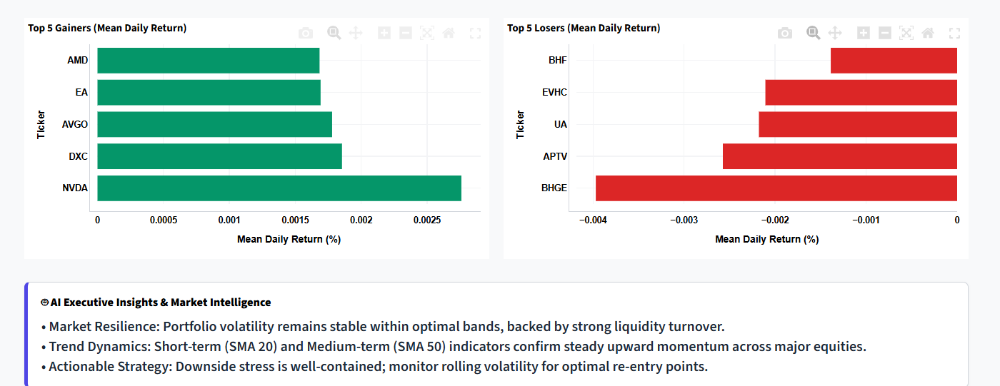

# 💼 S&P 500 Executive Intelligence Hub & Command Center

An enterprise-grade financial analytics dashboard built with **Python**, **Streamlit**, and **Plotly** to monitor, analyze, and visualize multi-year S&P 500 stock market data (2014–2017).

---
# 💼 S&P 500 Executive Intelligence Hub & Command Center

An enterprise-grade financial analytics dashboard built with **Python**, **Streamlit**, and **Plotly** to monitor, analyze, and visualize multi-year S&P 500 stock market data (2014–2017).

[](https://sp500-financial-analytics-f6alqyl7rwqp3hkhuhx6ku.streamlit.app/)

---
## 🎥 Demo & Walkthrough
> *Watch the live application demo below showcasing real-time filters, executive KPIs, and interactive financial charts.*

https://github.com/harshmeena9977-ops/sp500-financial-analytics/raw/main/assets/S%26P%20500%20demo.mp4

---

## 📸 Dashboard Preview & Visual Architecture

### 1. Executive KPI Command Cards
*A high-level snapshot tracking 12 core financial metrics including valuation, turnover, risk profile, and moving averages.*


### 2. Market Performance & Volatility Analytics
*Interactive time-series tracking closing price trends, trading volume activity, rolling volatility, and return distributions.*


### 3. Cumulative Growth & Price Spread Distribution
*Advanced financial charts highlighting compounded returns, intraday price spreads, volume correlations, and statistical boxplots.*


### 4. Top Performers, Laggards & AI Intelligence
*Automated ranking of Top 5 Gainers and Losers alongside real-time AI Executive Market Insights.*


---

## 🔍 Business Problem & Objective
Stock markets deal with massive volumes of multi-dimensional time-series data across hundreds of equities. Investors, financial analysts, and corporate executives face challenges in:
* Identifying true market momentum versus short-term noise.
* Tracking portfolio-wide and asset-specific volatility (risk management).
* Spotting top-performing assets and potential downside risks quickly.
* Analyzing liquidity turnover and price trends in real time.

**Solution:** The **S&P 500 Executive Intelligence Hub** aggregates nearly half a million financial records into an ultra-clean, high-performance command center. It provides deep-dive analytics, interactive filters, 12 executive KPIs, and 8+ professional financial visualizations.

---

## 📊 Dataset Overview (`sp500_processed.csv`)
* **Total Rows / Records:** 497,472+
* **Unique Equities (Symbols):** 505 S&P 500 companies
* **Timeframe:** Jan 2014 – Dec 2017
* **Key Features Available:** Open, High, Low, Close, Volume, Daily Returns, 20-Day & 50-Day Simple Moving Averages (SMA), Volatility, Price Spread, and Predictive Targets.

---

## 📈 Key Performance Indicators (KPIs) Built
The dashboard displays **12 core executive KPIs** arranged in a compact grid:
1. **Latest Close / S&P Index Price:** Current valuation with prior-day % change.
2. **Total Turnover:** Cumulative transaction value traded ($).
3. **20-Day Rolling Risk:** Market-wide/asset volatility standard deviation.
4. **Period High:** Peak resistance price level.
5. **Period Low:** Floor support price level.
6. **Mean Valuation:** Average closing price across the timeframe.
7. **Total Volume:** Total cumulative shares traded.
8. **Peak Volume:** Maximum single-session volume spike.
9. **Mean Daily Return:** Expected daily percentage yield.
10. **Max Drawdown:** Worst single-day drop recorded (downside stress).
11. **Latest SMA 20:** Short-term trend indicator.
12. **Latest SMA 50:** Medium-term trend indicator.

---

## 🛠️ Tech Stack & Libraries
* **Python 3.10+**
* **Streamlit** (For interactive web application layout)
* **Pandas & NumPy** (For data manipulation and calculations)
* **Plotly** (For high-performance financial charting)

---

## 🚀 How to Run Locally

1. **Clone the Repository:**
   ```bash
   git clone [https://github.com/harshmeena9977-ops/sp500-financial-analytics.git](https://github.com/harshmeena9977-ops/sp500-financial-analytics.git)
   cd sp500-financial-analytics